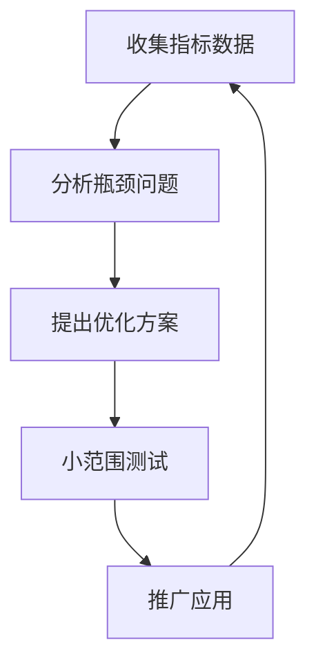

# 第 9 章：规范与效率平衡

## 9.1 规范与开发效率的辩证关系

前端代码规范与开发效率之间的关系常被误解为对立的。事实上，它们是相辅相成的。

### 9.1.1 规范对效率的正面影响

良好的代码规范能够：

1. **降低认知负担**：统一的代码风格使开发者无需在不同风格间切换思维模式
2. **减少决策疲劳**：规范已经为常见问题提供了标准解决方案
3. **提高协作效率**：团队成员能够更快理解彼此的代码
4. **简化代码审查**：审查者可以专注于逻辑而非格式问题
5. **加速新成员融入**：新加入的开发者能够更快适应项目风格

### 9.1.2 过度规范的负面影响

然而，过度严格的规范也可能：

1. **增加学习成本**：规则过多导致团队成员难以记忆和应用
2. **阻碍创新思维**：过于教条的规则可能限制解决问题的思路
3. **造成开发延迟**：频繁修复lint警告可能分散对核心业务的注意力
4. **引发团队抵触**：过于严格的规则会导致团队成员反感

### 9.1.3 平衡视角

规范和效率不是非此即彼的关系，而是需要找到适合团队的平衡点。短期的规范学习成本通常会转化为长期的效率提升。

```javascript
// 不规范但看似简洁的代码
function fn(a,b){var c=a+b;return c*2}

// 规范且同样简洁的代码
function sum(a, b) {
  const result = a + b;
  return result * 2;
}
```

## 9.2 构建适应性规范策略

### 9.2.1 分级规则体系

构建一个分级规则体系，可以帮助平衡规范性和灵活性：

| 规则级别 | 定义 | 违规后果 | 应用场景 |
|---------|------|---------|---------|
| 强制级 | 必须遵守的核心规则 | 阻止提交/构建 | 可能导致bug或安全问题的规则 |
| 警告级 | 建议遵守但可灵活处理 | 警告提示但不阻止 | 代码质量和风格相关规则 |
| 建议级 | 团队共识的最佳实践 | 仅作文档参考 | 特定场景的优化建议 |

这种分级策略允许团队聚焦于最重要的规则，同时为开发者提供一定的灵活性。

### 9.2.2 上下文感知规则

规则应当对代码的上下文有所感知，不同类型的文件可能需要不同的规则集：

```javascript
// .eslintrc.js
module.exports = {
  overrides: [
    {
      files: ['*.test.js'],
      rules: {
        // 测试文件中放宽一些规则限制
        'max-lines': 'off',
        'max-nested-callbacks': 'off'
      }
    },
    {
      files: ['*.config.js'],
      rules: {
        // 配置文件中允许CommonJS模块语法
        'import/no-commonjs': 'off'
      }
    }
  ]
};
```

### 9.2.3 渐进式采用策略

对于现有项目，渐进式采用规范是平衡效率的关键：

1. **新代码严格执行**：所有新编写的代码严格遵循规范
2. **重构时更新**：对旧代码进行修改时顺便符合新规范
3. **关键模块优先**：优先规范化核心业务逻辑和共享组件
4. **设置宽限期**：为团队提供足够的时间适应新规范

## 9.3 开发工具链优化

### 9.3.1 自动化工具配置

合理配置自动化工具可以大幅降低遵循规范的成本：

```javascript
// package.json
{
  "scripts": {
    "lint": "eslint --ext .js,.jsx,.ts,.tsx src",
    "lint:fix": "eslint --ext .js,.jsx,.ts,.tsx src --fix",
    "format": "prettier --write \"src/**/*.{js,jsx,ts,tsx,css,scss,md}\"",
    "precommit": "lint-staged"
  },
  "lint-staged": {
    "*.{js,jsx,ts,tsx}": [
      "eslint --fix",
      "prettier --write"
    ],
    "*.{css,scss}": [
      "stylelint --fix",
      "prettier --write"
    ],
    "*.md": "prettier --write"
  }
}
```

### 9.3.2 编辑器集成

将规范工具集成到开发者的编辑器中，可以实现即时反馈：

1. **VS Code设置**：
```json
{
  "editor.formatOnSave": true,
  "editor.codeActionsOnSave": {
    "source.fixAll.eslint": true,
    "source.fixAll.stylelint": true
  },
  "eslint.validate": [
    "javascript",
    "javascriptreact",
    "typescript",
    "typescriptreact"
  ]
}
```

2. **WebStorm设置**：
   - 开启ESLint自动修复
   - 配置保存时格式化
   - 启用实时lint检查

这种集成让规范遵循变成一种无感的体验，开发者无需额外的操作即可生成符合规范的代码。

### 9.3.3 性能优化策略

规范工具的性能问题也可能影响开发效率，可以采取以下措施：

1. **缓存机制**：启用ESLint和Stylelint的缓存选项
   ```bash
   eslint --cache --ext .js,.jsx,.ts,.tsx src
   ```

2. **增量检查**：仅检查修改的文件
   ```bash
   npx lint-staged
   ```

3. **并行处理**：利用多核处理能力加速检查
   ```bash
   eslint --parallel src
   ```

4. **忽略不必要文件**：配置`.eslintignore`和`.stylelintignore`排除无需检查的文件

## 9.4 常见效率问题及解决方案

### 9.4.1 大型项目中的性能问题

| 问题 | 原因 | 解决方案 |
|-----|-----|---------|
| Lint检查过慢 | 文件数量过多、规则复杂度高 | 使用缓存、增量检查、并行处理 |
| 频繁构建失败 | 规则过于严格 | 分级规则、渐进式采用 |
| 开发流中断 | 规则冲突或配置错误 | 预设配置、统一工具版本 |
| 新手上手困难 | 规则体系复杂 | 文档完善、示例代码、培训 |

### 9.4.2 规则冲突解决方法

规则冲突是效率低下的常见原因，可以通过以下步骤解决：

1. **识别冲突来源**：
   ```bash
   eslint --print-config src/index.js
   ```

2. **明确规则优先级**：
   ```javascript
   // .eslintrc.js
   module.exports = {
     extends: [
       'eslint:recommended',
       'plugin:react/recommended',
       // 将有冲突的配置放在后面以覆盖前面的规则
       'prettier'
     ]
   };
   ```

3. **显式禁用冲突规则**：
   ```javascript
   rules: {
     // 当两个规则有冲突时，明确禁用一个
     'react/jsx-curly-newline': 'off',
     // 或者调整规则选项以兼容
     'indent': ['error', 2, { 'SwitchCase': 1 }]
   }
   ```

### 9.4.3 自动修复的局限性

自动修复虽然高效，但也存在局限性：

1. **逻辑错误无法修复**：工具只能修复格式问题，无法解决逻辑缺陷
2. **部分规则无自动修复**：某些复杂规则需要人工干预
3. **级联修复风险**：一处修复可能触发其他地方的新问题

对于无法自动修复的问题，可以采用：
- 编写自定义修复器
- 创建代码片段模板
- 开发项目专用的代码生成工具

## 9.5 度量与优化

### 9.5.1 效率指标定义

要客观评估规范对效率的影响，需要建立可量化的指标：

1. **开发周期时间**：功能从开始到完成的时长
2. **构建/检查时间**：lint和格式化检查的执行时间
3. **规则违反率**：每千行代码中的规则违反次数
4. **修复时间占比**：用于修复规范问题的时间百分比
5. **开发者满意度**：团队对规范工具的满意程度调查

### 9.5.2 持续优化机制

基于指标数据，建立持续优化机制：



### 9.5.3 案例分析

某前端团队通过以下优化措施，将规范检查时间从2分钟缩短到15秒：

1. 启用ESLint缓存
2. 配置增量检查
3. 优化规则集，移除重复或低价值规则
4. 升级工具版本以利用新的性能改进
5. 调整CI流程，并行执行检查

结果不仅提高了开发效率，还改善了团队对规范的接受度。

## 9.6 未来趋势与展望

### 9.6.1 AI辅助代码规范

人工智能正在改变代码规范的实施方式：

1. **智能代码补全**：如GitHub Copilot已能生成符合项目规范的代码
2. **上下文感知建议**：基于代码上下文提供符合规范的改进建议
3. **自适应规则**：根据项目特点自动调整规则严格程度

```javascript
// 未来的AI辅助可能实现的智能建议
function poorlyNamedFunc(x, y) { // AI建议：重命名函数为更具描述性的名称
  let z = x + y; // AI建议：将let转换为const，因为变量未被重新赋值
  return z;
}
```

### 9.6.2 规范工具发展方向

规范工具未来的发展趋势：

1. **统一工具链**：ESLint、Prettier、Stylelint进一步整合
2. **语言服务集成**：与TypeScript、JavaScript语言服务深度集成
3. **实时协作支持**：适应团队远程协作和实时代码共享场景
4. **自动学习项目风格**：从现有代码库学习并建议最佳规范

### 9.6.3 平衡的持续挑战

在可预见的未来，平衡规范与效率仍将是一个持续的挑战：

1. **新技术适应**：规范需不断适应新框架和语言特性
2. **团队规模问题**：大型团队和小型团队需要不同的规范策略
3. **跨语言统一**：全栈开发环境下的规范一致性

最终，成功的规范策略将是那些能够适应变化、服务于开发者而非限制开发者的策略。

## 总结

代码规范与开发效率之间并非对立关系，而是需要寻找平衡点。通过分级规则体系、渐进式采用、工具链优化和持续度量改进，可以在保证代码质量的同时提升开发效率。未来，人工智能和更智能的工具将进一步减少规范遵循的成本，但平衡的艺术仍需团队的持续关注和调整。

规范的终极目标不是约束，而是赋能——让开发者能够更专注于创造价值，而非纠结于格式细节。
